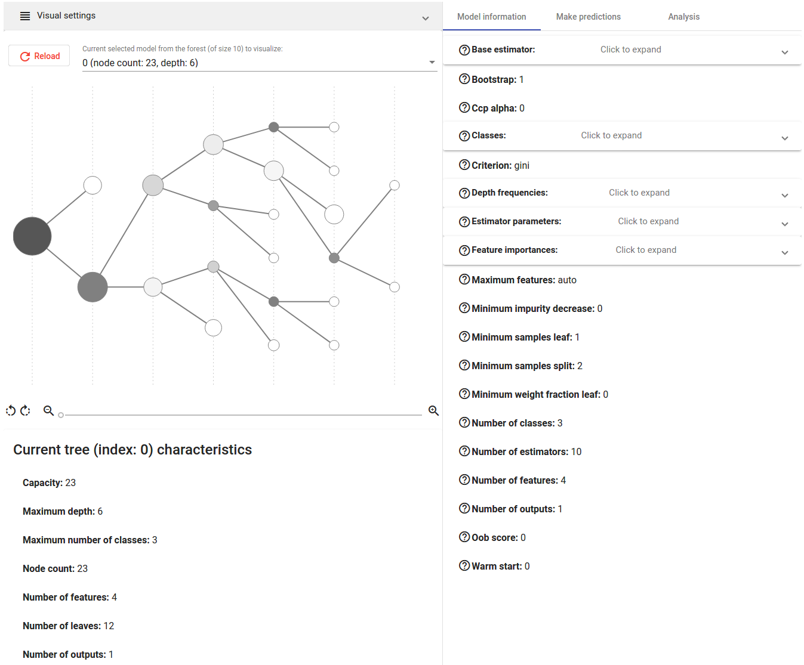
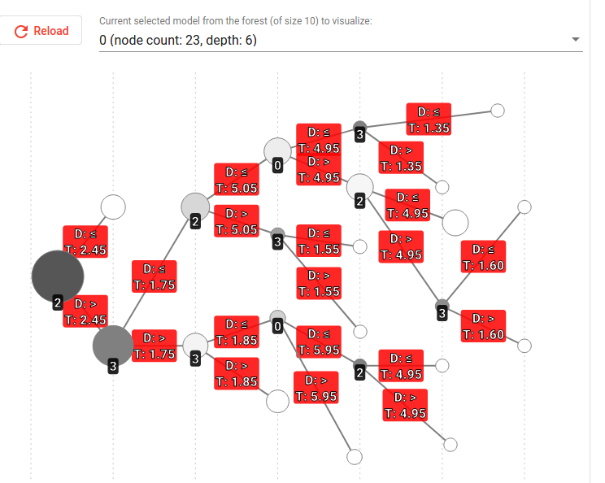
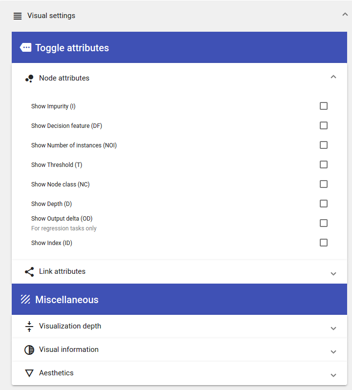
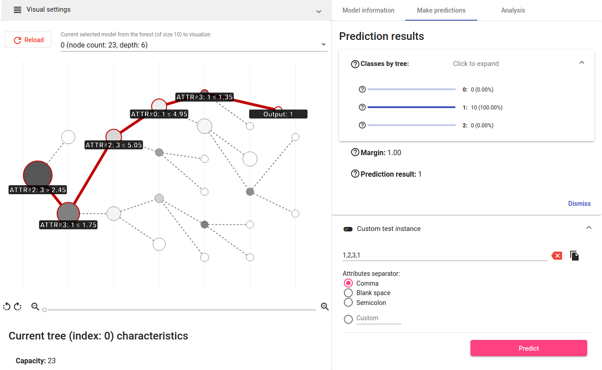
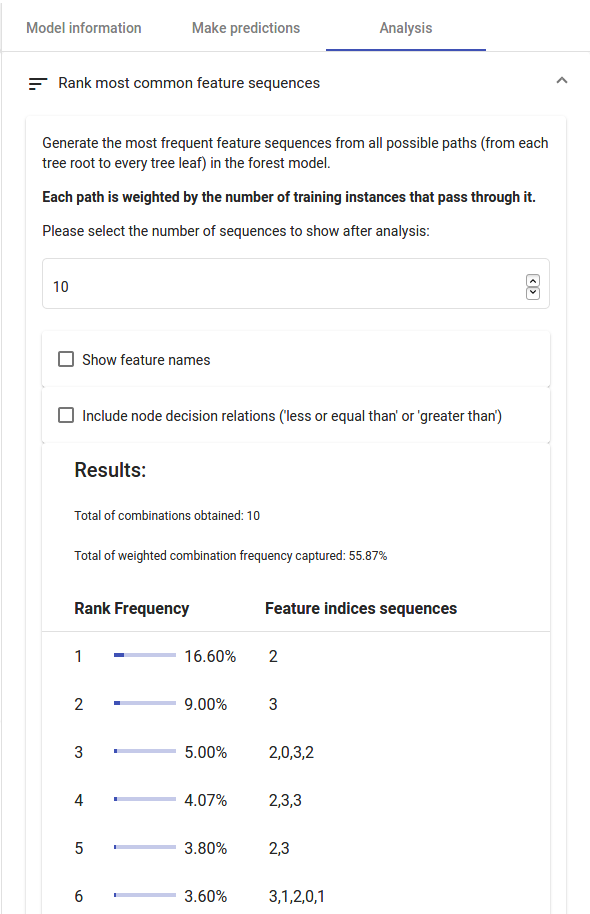
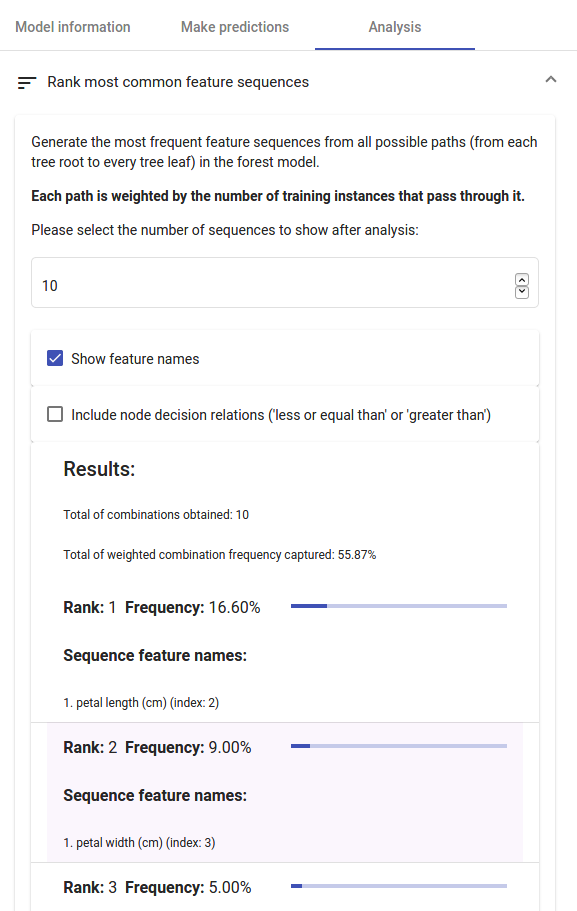
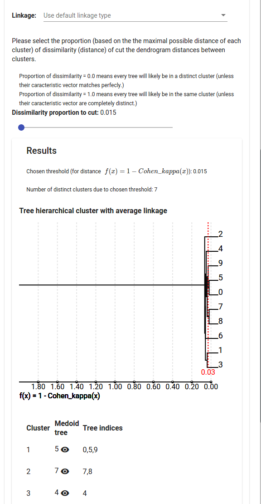

## Nyata: visualization of Decision Tree and Random Forest models

- Web platform to visualize and interpret Random Forests and Decision Tree models.
- Compatible with scikit-learn tree and forest models.
- Can be used with both Classification and Regression models.

---

## Summary

This document is organized as follows:

1. [Installation instructions](#nyata-installation);
2. [Dependency list](#nyata-dependencies);
3. [Run instructions](#running-nyata);
4. [Usage](#using-nyata);
5. [Security considerations](#security-considerations);
6. [Presenting Nyata main features](#nyata-main-features).

---

<a name="nyata-installation"></a>

## Instalation instructions
First things first, you need to have **Python 3**, **pip**, [**node.js** and **npm**](https://github.com/nvm-sh/nvm), and [**angular 2**](https://angular.io/cli) installed in your local machine in order to proceed with the Nyata installation.

After everything listed above checks out, now you need to install both the dependencies from the front-end and back-end. The script `install.sh` should do all the work for you with a bit of luck, if you run it giving your package manager as argument:

```bash
./install.sh <your package manager>
```
I wrote down the `Makefile` clauses for the following package managers: `yay`, `pacman`, `apt`, and `apt-get`. If your package manager is not in this list, just look into the `backend/Makefile` file and provide the installation commands by yourself.
```bash
./install.sh pacman
```
```bash
./install.sh yay
```
```bash
./install.sh apt
```
```bash
./install.sh apt-get
```

---

<a name="nyata-dependencies"></a>

## Dependency list

Nyata depends on the following third-party softwares:
- Python 3
- Packages for Python 3 (check `backend/requirements.txt` for the complete list)
- Redis
- npm
- Angular 2
- Tons of javascript/typescript/angular dependencies

---

<a name="running-nyata"></a>

## Run instructions

After everything is installed correctly, you can run Nyata using `run.sh`:
```bash
./run.sh
```
If, for some reason, that does not work as expected, you can try to activate both back-end and front-end using its respectives Makefiles.

After activating the front-end, your default web browser should conveniently pop up with the Nyata application ready for use. If this is not the case, the front-end is served in [http://localhost:4200](http://localhost:4200) by default, and the back-end is served in [http://localhost:5000](http://localhost:5000).

Note that some web browsers does not support Nyata front-end.

---

<a name="using-nyata"></a>

## Usage

After both backend and frontend are running, you can use Nyata directly from your web browser ([http://localhost:4200](http://localhost:4200)). At first, you'll see an upload button asking for a `.pickle` file, which are Serialized Python Objections. The construction of this `.pickle` file is a bit specific, so a function from the backend, `nyata.create_pickle`, is available to create it for you after you given the required objects.

The [visualization_example.ipynb](visualization_example.ipynb) jupyter notebook demonstrating the `nyata.create_pickle` usage is available in this repository, so you can easily check it out and reproduce with your forest model.

---

<a name="security-considerations"></a>

## Security considerations

If you're going to use the current version of Nyata in your system, remember that:
- Do not use the public available secret key given in the `backend/Makefile`, since it is just for debugging purposes
- Nyata receives an `.pickle` file as front-end input, and `.pickle` files are not secure. Hence, you'll probably want to keep Nyata as a personal tool, and not expose your system to the public.

---

<a name="nyata-main-features"></a>

## Presenting Nyata main features

- The platform works with sklearn Random Forest Classifiers and Regressors, and Decision Tree Classifiers and Regressors;
- Model parameter summary and statistics;

- Interactive view of every tree in the forest;


- Prediction of a custom instance or an entire dataset of test instances;

- Analysis of the most common rules of the forest; and


- Tree hierarchical clustering based on prediction values or tree meta-characteristics.

